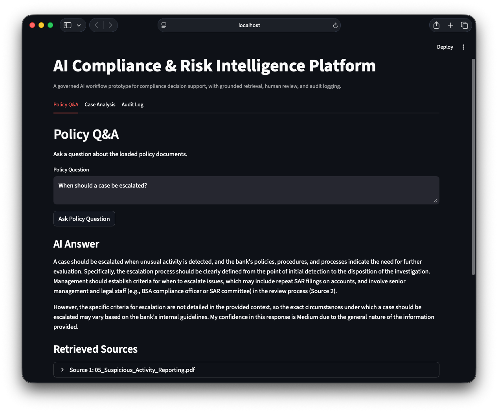
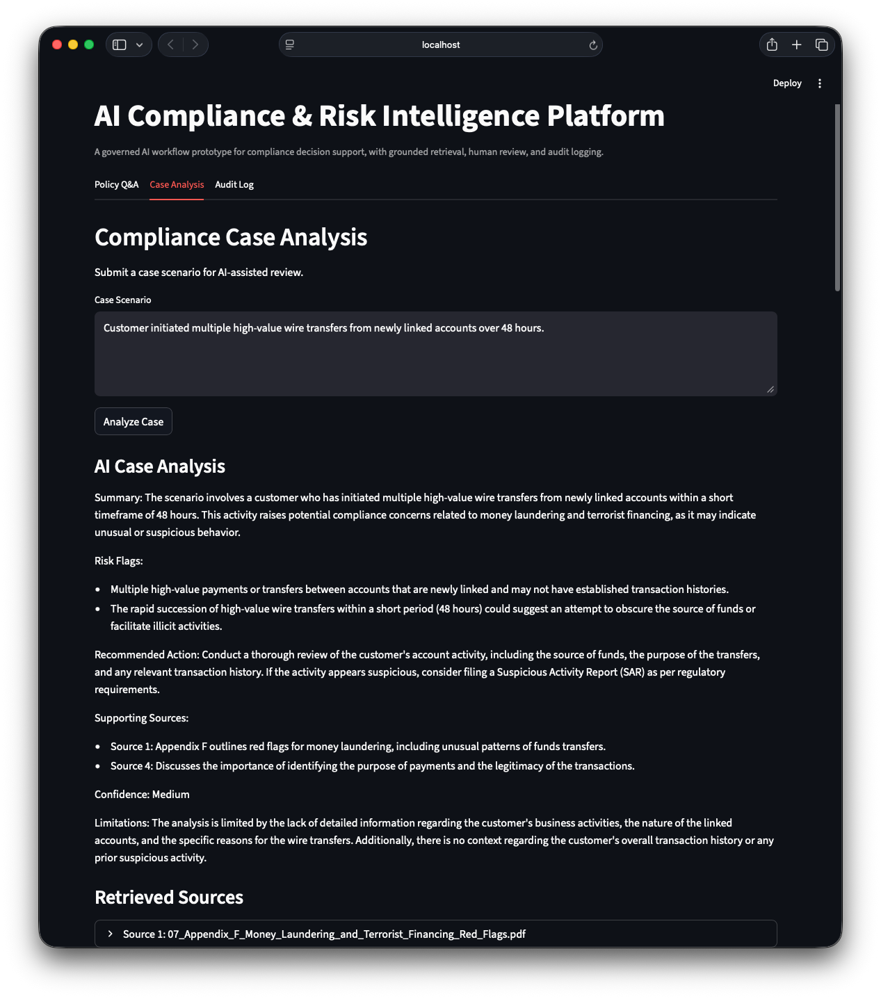
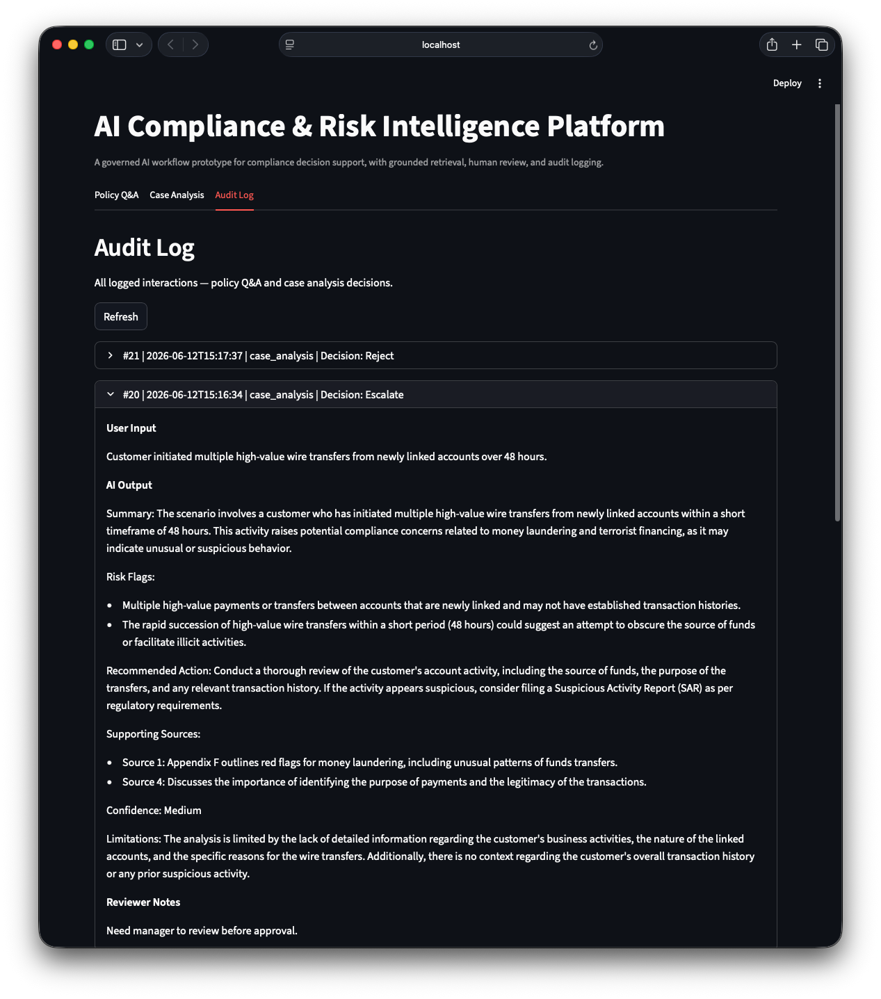

# AI Compliance & Risk Intelligence Platform

## Overview

This project is a prototype of an AI-powered compliance and risk intelligence platform designed for regulated environments such as financial services, insurance, and enterprise risk management.

The goal is to demonstrate how large language models (LLMs) can be integrated into real-world decision workflows while maintaining explainability, auditability, and human oversight.

Unlike generic AI assistants, this system is designed around **governed AI usage**, where outputs are grounded in source data, reviewed by humans, and fully traceable for audit and compliance purposes.

---

## Problem

Compliance and risk teams face several challenges:

- Large volumes of policies, regulations, and internal documentation
- Manual and inconsistent decision-making processes
- Limited traceability into how decisions are made
- Pressure to adopt AI without introducing regulatory risk

Existing tools are often rule-based, rigid, and lack the flexibility to scale with increasing complexity.

---

## Solution

This platform introduces an AI-assisted workflow that:

- Uses **retrieval-augmented generation (RAG)** to ground responses in policy documents
- Provides **structured, schema-validated risk analysis** for compliance scenarios
- Incorporates **human-in-the-loop review** to ensure responsible decision-making
- Maintains a full **audit trail** of inputs, outputs, and decisions

---

## Core Features

### 1. Regulatory Knowledge Search

- Ask natural language questions about regulatory requirements
- Semantic retrieval across FFIEC BSA/AML guidance
- Grounded AI responses based on retrieved documents
- Source traceability and document-level citations

### 2. AI-Assisted Case Analysis

- Submit compliance scenarios for review
- Schema-validated structured AI outputs for:
  - Summary
  - Risk flags
  - Recommended action
  - Confidence
  - Limitations
- Supporting source retrieval remains separate from model-generated analysis
- Structured results are serialized to JSON for audit logging

### 3. Human-in-the-Loop Review

- Human review remains required
- Final decisions are recorded explicitly
- AI serves as a decision-support tool rather than an authority

### 4. Audit Logging

The platform captures:

- User inputs
- Retrieved source documents
- AI-generated outputs
- Human reviewer decisions
- Reviewer notes
- Timestamps

### 5. Source Traceability

Every recommendation can be traced back to:

- Retrieved documents
- Regulatory sections
- Source paths
- Supporting text chunks

This enables explainability and auditability in regulated environments.

---

## Demo Highlights

- Regulatory Q&A powered by Retrieval-Augmented Generation (RAG)
- AI-assisted compliance case analysis
- Human-in-the-loop review workflow
- Full audit logging
- Source traceability across FFIEC BSA/AML guidance

---

## Screenshots

### Policy Q&A

The platform retrieves relevant FFIEC guidance and generates grounded responses with full source traceability.

### AI-Assisted Case Analysis

Compliance scenarios are analyzed against regulatory guidance, with identified risk factors, recommendations, confidence levels, and supporting sources.

### Audit Log

All interactions, AI outputs, human decisions, and reviewer notes are recorded to support governance and auditability.

---

## Architecture (High-Level)

The system is designed as a modular AI workflow platform:

- Document ingestion and chunking
- Vector-based retrieval for policy search
- LLM-powered analysis layer
- Schema validation and structured output handling
- Human review workflow
- Audit logging and traceability layer

(See `/docs/system-architecture.md` for details)

---

## Current Corpus

The platform currently indexes and searches over:

- 80+ FFIEC BSA/AML regulatory guidance documents
- 1,000+ embedded document chunks
- Multiple examination manual sections, appendices, and regulatory requirements

The corpus is processed through a PDF ingestion pipeline, chunked, embedded, and indexed in ChromaDB for semantic retrieval.

---

## Example Workflow

1. A compliance analyst submits a case scenario
2. The system retrieves relevant policy sections
3. The AI generates a schema-validated structured risk analysis
4. The analyst reviews the recommendation and supporting evidence
5. The final human decision is recorded
6. The structured AI output and review data are logged for audit purposes

---

## Design Principles

- **Explainability over automation**
- **Human oversight is required**
- **All outputs must be traceable**
- **AI is assistive, not authoritative**
- **Structured outputs over free-form responses**

---

## Tech Stack

- Python
- OpenAI API
- ChromaDB (Vector Database)
- SQLite (Audit Logging)
- Streamlit (User Interface)
- pypdf (Document Processing)
- Retrieval-Augmented Generation (RAG)
- FFIEC BSA/AML Regulatory Corpus (80+ Documents)
- Pydantic (Structured Output Validation)

---

## Roadmap

- [x] Document ingestion pipeline
- [x] RAG-based policy Q&A
- [x] Case analysis workflow
- [x] Human review interface
- [x] Audit logging system
- [x] FFIEC PDF corpus ingestion
- [x] Source traceability
- [x] Streamlit workflow refinements
- [x] Structured JSON outputs
- [ ] Evaluation and monitoring framework
- [ ] Prompt/version tracking
- [ ] Role-based review workflows

---

## Purpose of This Project

This project is intended to demonstrate:

- AI product design in regulated environments
- Integration of LLMs into real workflows
- Governance, risk, and compliance considerations
- System architecture and tradeoff thinking
- Practical implementation of AI-powered platforms

---

## License

Copyright © 2026 Scott DeForest. All rights reserved.

This repository is available for viewing and evaluation only. No permission is
granted to copy, modify, distribute, deploy, or create derivative works without
prior written permission. See [LICENSE](LICENSE) for details.